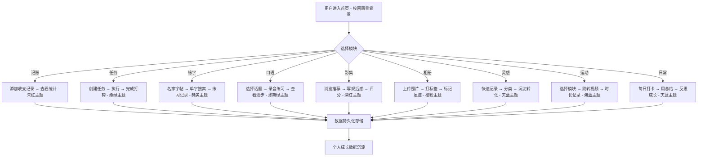

# 鈡净毓 - 个人工作台产品需求文档 (PRD)

## 1. 产品概述
「鈡净毓」是一款面向个人用户的综合生活管理工作台，以《Skip and Loafer》温柔治愈的插画风格为视觉基底，集成记账、任务管理、学习练习、影像记录、运动追踪等9大核心模块，帮助用户一站式管理日常生活的方方面面。

- **核心价值**：将碎片化的生活管理需求整合至一个温柔的美学空间，以艺术作品为视觉锚点，提供流畅、治愈的使用体验
- **目标用户**：注重生活品质、热爱动漫文化、希望系统化管理日常的个人用户
- **产品定位**：个人数字花园 / 生活操作系统 · 动漫美学版

## 2. 核心功能

### 2.1 功能模块总览

| 序号 | 模块名称 | 核心功能 | 主题图片 | 色彩关键词 |
|------|----------|----------|----------|------------|
| 1 | 记账 | 收入支出记录、分类统计、月度报表 | 191114.jpg 冬日鸟居 | 朱红·雪白·暖橙 |
| 2 | 任务待办清单 | 任务创建、优先级排序、截止日期、完成状态 | 191107.jpg 活力拼贴 | 嫩绿·暖黄·桃粉 |
| 3 | 练字 | 名家字帖总集、单字搜索字范、进度记录 | 190916.jpg 书籍少女 | 赭黄·墨绿·米白 |
| 4 | 口语练习 | 练习内容库、录音对比、进步追踪 | 191110.jpg 拍立得 | 薄荷绿·暖米·豆绿 |
| 5 | 影集 | 观影推荐、推荐理由、个人观后感 | 190928.jpg 读书少年 | 深红·暖米·藏青 |
| 6 | 相册 | 照片标签系统、足迹地图、时间线浏览 | 190912.jpg 浴衣少女 | 樱粉·金黄·蜜桃 |
| 7 | 灵感一现 | 快速记录灵感想法、标签分类、搜索 | 190934.jpg 绘画情侣 | 天蓝·珊瑚·明黄 |
| 8 | 运动集 | 运动模块分类、时长记录、跳转指定视频 | 191112.jpg 海边漫步 | 海蓝·沙色·青碧 |
| 9 | 日常记录 | 每周周期打卡、完成度统计(√)、周总结反思 | 190904.jpg 奔跑学生 | 天蓝·暖米·樱红 |
| - | 首页背景 | 工作台总览、模块导航 | 190935.jpg 校园窗景 | 暖阳·绿意·宁静 |

### 2.2 页面详情

#### 首页（工作台总览）
| 模块 | 功能描述 |
|------|----------|
| 顶部导航 | 「鈡净毓」品牌标识、9大模块快速入口、全局搜索 |
| 背景图片 | 校园窗景图作为首页背景，叠加柔和渐变 |
| 九宫格导航 | 9个模块卡片，每张封面使用对应模块图片的特色物体、下方标注功能名 |
| 今日概览 | 今日待办、本月支出、连续打卡等摘要卡片 |
| 快捷操作 | 快速记账、添加任务、记录灵感等常用功能快捷入口 |

#### 模块1：记账 — 朱红·暖橙主题
| 模块 | 功能描述 |
|------|----------|
| 封面特色物体 | 朱红色鸟居 / 灯笼 |
| 账目列表 | 按日期展示收支记录、分类图标显示 |
| 添加记录 | 金额、分类、备注、日期选择 |
| 统计面板 | 月度收支图表、分类占比环形图、趋势折线图 |
| 分类管理 | 自定义收支分类、图标选择 |

#### 模块2：任务待办清单 — 嫩绿·暖黄主题
| 模块 | 功能描述 |
|------|----------|
| 封面特色物体 | 奔跑的身影 / 活力绿色 |
| 任务列表 | 看板视图（待办/进行中/已完成）、拖拽排序 |
| 添加任务 | 标题、描述、优先级、截止日期、标签 |
| 筛选排序 | 按优先级/日期/标签筛选、多种排序方式 |
| 进度统计 | 完成率、每日任务数统计 |

#### 模块3：练字 — 赭黄·墨绿主题
| 模块 | 功能描述 |
|------|----------|
| 封面特色物体 | 书籍 / 眼镜 / 字帖 |
| **名家字帖总集** | 历代名家字帖分类浏览（楷书、行书、草书、隶书） |
| **单字搜索** | 输入任意汉字，快速找到各名家的字范 |
| 练习记录 | 练习日期、时长、作品上传 |
| 进度追踪 | 练字日历、连续天数统计、水平雷达图 |

#### 模块4：口语练习 — 薄荷绿·暖米主题
| 模块 | 功能描述 |
|------|----------|
| 封面特色物体 | 拍立得相片 / 对话气泡 |
| 内容库 | 话题分类、难度等级、场景对话 |
| 录音练习 | 在线录音播放、时长记录 |
| 进步追踪 | 练习时长统计、话题覆盖度 |

#### 模块5：影集 — 深红·藏青主题
| 模块 | 功能描述 |
|------|----------|
| 封面特色物体 | 书本 / 深红背景 |
| 观影列表 | 卡片式展示电影/剧集、海报、评分 |
| 观后感 | 个人评分、文字感悟、标签分类 |
| 推荐理由 | 推荐语、类型标签、观看日期 |
| 筛选浏览 | 按类型/年代/评分筛选 |

#### 模块6：相册 — 樱粉·金黄主题
| 模块 | 功能描述 |
|------|----------|
| 封面特色物体 | 浴衣 / 樱花 / 和风配饰 |
| 照片墙 | 瀑布流布局、标签筛选 |
| 足迹地图 | 地点标记、时间线浏览 |
| 标签系统 | 自定义标签、智能分类 |
| 相册管理 | 创建相册、批量管理 |

#### 模块7：灵感一现 — 天蓝·珊瑚主题
| 模块 | 功能描述 |
|------|----------|
| 封面特色物体 | 画笔 / 彩色颜料 / 彩虹 |
| 灵感墙 | 便签式展示、自由排列 |
| 快速记录 | 弹窗快速输入、支持 Markdown |
| 搜索筛选 | 关键词搜索、标签筛选 |
| 灵感沉淀 | 收藏/归档、灵感转化率统计 |

#### 模块8：运动集 — 海蓝·青碧主题
| 模块 | 功能描述 |
|------|----------|
| 封面特色物体 | 海浪 / 自行车 / 活力身影 |
| 运动分类 | 跑步/瑜伽/力量/有氧等模块 |
| 视频跳转 | 跳转到对应APP的指定视频（keep/b站等） |
| **时长记录** | 每次运动的精确时长记录、累计时长统计 |
| 训练记录 | 训练时长、完成状态、日期打卡 |
| 成就系统 | 连续打卡天数、总训练时长、里程碑 |

#### 模块9：日常记录 — 天蓝·暖米主题
| 模块 | 功能描述 |
|------|----------|
| 封面特色物体 | 校服 / 书包 / 奔跑的学生 |
| 周视图 | 7天打卡格子、完成打√ |
| 目标设置 | 每周目标项、自定义打卡项 |
| 周总结 | 自动计算完成度（如3/7）、心得反思输入 |
| 历史回顾 | 历史周次浏览、完成率趋势图 |

## 3. 核心流程

## 4. 用户界面设计

### 4.1 设计风格

**整体美学方向：动漫治愈系 · Skip and Loafer 艺术风格**

以《Skip and Loafer》的温柔插画为视觉基底，每个模块从对应的主题图片中提取色彩和情感基调，形成统一又各具特色的视觉体系。

- **色彩方案 — 各模块独立主题色**：

| 模块 | 主色 | 辅色 | 点缀色 | 来源图片 |
|------|------|------|--------|----------|
| 全局/首页 | 暖阳米 `#F5F1EB` | 嫩绿 `#8BA888` | 晨光金 `#E8C547` | 190935.jpg 校园窗景 |
| 记账 | 朱红 `#B54A3A` | 暖橙 `#E8A87C` | 雪白 `#F5F1EB` | 191114.jpg 冬日鸟居 |
| 任务待办 | 嫩绿 `#8BA888` | 暖黄 `#E8D5B7` | 桃粉 `#E8B4B8` | 191107.jpg 活力拼贴 |
| 练字 | 赭黄 `#D4A574` | 墨绿 `#2C5F5A` | 米白 `#FDF6E3` | 190916.jpg 书籍少女 |
| 口语练习 | 薄荷 `#B8D4B8` | 暖米 `#F5E6D3` | 豆绿 `#7CB5A5` | 191110.jpg 拍立得 |
| 影集 | 深红 `#8B2635` | 暖米 `#F5E6D3` | 藏青 `#1F3A5F` | 190928.jpg 读书少年 |
| 相册 | 樱粉 `#E8B4B8` | 金黄 `#F4D03F` | 蜜桃 `#FFCBA4` | 190912.jpg 浴衣少女 |
| 灵感 | 天蓝 `#87CEEB` | 珊瑚 `#FF7F50` | 明黄 `#FFD700` | 190934.jpg 绘画情侣 |
| 运动 | 海蓝 `#4A90A4` | 沙色 `#E8D5B7` | 青碧 `#2E8B8B` | 191112.jpg 海边漫步 |
| 日常记录 | 天蓝 `#9FC4C4` | 暖米 `#F5E6D3` | 樱红 `#C45A5A` | 190904.jpg 奔跑学生 |

- **字体选择**：
  - 标题字体：霞鹜文楷 / Nunito（圆润友好，匹配动漫感）
  - 正文字体：Noto Sans SC / M PLUS Rounded 1c（圆润柔和）
  - 英文/数字：Quicksand / Nunito

- **布局风格**：
  - 卡片式布局、大量留白
  - 每个模块卡片使用对应主题图片的特色物体作为封面
  - 细腻的分隔线和装饰元素
  - 柔和的渐变背景，参考插画中的光影氛围
  - 首页背景使用校园窗景图片 + 柔光叠加

- **图标风格**：
  - 圆润线性图标，柔和边角
  - Lucide React 图标库
  - 每个模块配有专属主题图标

### 4.2 页面设计概览

| 页面名称 | 模块名称 | UI元素 |
|----------|----------|--------|
| 首页 | 背景层 | 校园窗景图全屏背景 + 柔光渐变叠加 |
| 首页 | 品牌区域 | 「鈡净毓」圆润标题、副标题、日期印章 |
| 首页 | 九宫格导航 | 9个模块卡片，特色物体封面图 + 功能名标注 |
| 首页 | 今日概览 | 今日待办、本月支出、连续打卡等摘要卡片 |
| 记账页 | 账目列表 | 时间线布局、朱红主题、分类图标 |
| 记账页 | 统计图表 | 环形图、折线图、柱状图 |
| 任务页 | 看板 | 三列布局、嫩绿主题、卡片拖拽 |
| 练字页 | 字帖展示 | 网格布局、名家字帖、单字搜索框 |
| 练字页 | 字范详情 | 点击汉字展示各名家字范、临摹对比 |
| 日常页 | 周视图 | 7格横向布局、√完成标记、完成度环 |
| 灵感页 | 便签墙 | 自由排列便签、柔和色彩、随机旋转 |
| 运动页 | 运动分类 | 海蓝主题卡片、时长进度条 |

### 4.3 响应式设计

- **桌面优先**：以 1440px 为基准设计
- **平板适配**：768px - 1024px，模块网格自适应
- **移动端**：< 768px，单列垂直布局、底部导航栏
- **触摸优化**：足够的点击区域（≥44px）、手势支持

## 5. 数据模型概要

### 5.1 核心数据实体

- **用户设置**：主题、偏好、默认视图
- **账目记录**：金额、类型、分类、日期、备注
- **任务**：标题、描述、优先级、截止日期、状态
- **练字记录**：字帖ID、汉字、日期、时长、笔记
- **名家字帖库**：书法家、朝代、字体类型、单字字范图片
- **口语练习**：话题ID、日期、时长、录音URL
- **影片**：标题、类型、评分、观后感、推荐理由
- **照片**：URL、标签、地点、日期
- **灵感**：内容、标签、创建时间、状态
- **运动记录**：类型、时长、日期、完成状态
- **日常打卡**：周次、目标项、完成状态、周总结