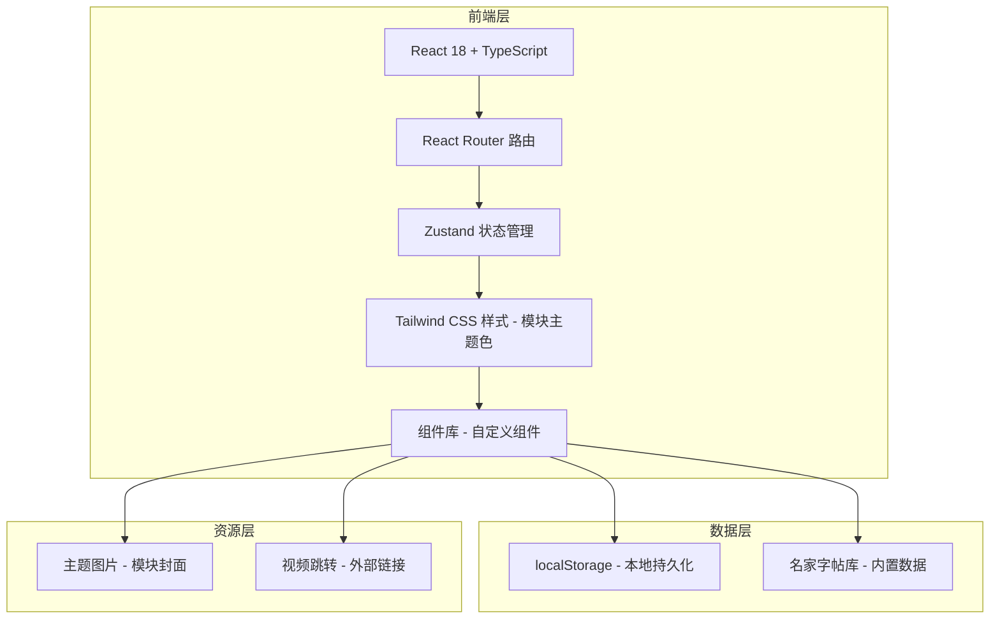

# 鈡净毓 - 技术架构文档

## 1. 架构设计



## 2. 技术选型

| 类别 | 技术 | 版本 | 说明 |
|------|------|------|------|
| 前端框架 | React | 18.x | 核心UI框架 |
| 语言 | TypeScript | 5.x | 类型安全 |
| 构建工具 | Vite | 5.x | 快速开发与构建 |
| CSS框架 | Tailwind CSS | 3.x | 原子化CSS + 自定义主题色 |
| 路由 | React Router | 6.x | SPA路由管理 |
| 状态管理 | Zustand | 4.x | 轻量级全局状态 |
| 图标 | Lucide React | latest | 精美线性图标 |
| 包管理 | npm | - | 依赖管理 |

## 3. 路由定义

| 路由路径 | 页面名称 | 功能说明 | 主题色 |
|----------|----------|----------|--------|
| `/` | 首页 | 校园窗景背景 + 9模块卡片导航 | 暖阳米 + 嫩绿 |
| `/accounting` | 记账 | 收支记录、统计图表 | 朱红·暖橙 |
| `/tasks` | 任务待办清单 | 看板视图、任务管理 | 嫩绿·暖黄 |
| `/calligraphy` | 练字 | 名家字帖总集、单字搜索 | 赭黄·墨绿 |
| `/speaking` | 口语练习 | 话题库、录音练习 | 薄荷绿·暖米 |
| `/films` | 影集 | 影片列表、观后感 | 深红·藏青 |
| `/photos` | 相册 | 照片墙、足迹地图 | 樱粉·金黄 |
| `/inspiration` | 灵感一现 | 灵感便签、快速记录 | 天蓝·珊瑚 |
| `/sports` | 运动集 | 运动模块、时长记录 | 海蓝·青碧 |
| `/daily` | 日常记录 | 周打卡、周总结 | 天蓝·暖米 |

## 4. 主题色彩系统

### 4.1 各模块主题色定义

```typescript
// src/config/themeColors.ts
export const moduleThemes = {
  home: {
    primary: '#F5F1EB',   // 暖阳米
    secondary: '#8BA888', // 嫩绿
    accent: '#E8C547',    // 晨光金
    bg: 'linear-gradient(135deg, #F5F1EB 0%, #E8D5B7 100%)',
    image: '/images/190935.jpg',
  },
  accounting: {
    primary: '#B54A3A',   // 朱红
    secondary: '#E8A87C', // 暖橙
    accent: '#F5F1EB',    // 雪白
    bg: 'linear-gradient(135deg, #F5E6D3 0%, #E8A87C 100%)',
    image: '/images/191114.jpg',
    icon: 'torii',
    coverObject: '鸟居/灯笼',
  },
  tasks: {
    primary: '#8BA888',   // 嫩绿
    secondary: '#E8D5B7', // 暖黄
    accent: '#E8B4B8',    // 桃粉
    bg: 'linear-gradient(135deg, #F5E6D3 0%, #8BA888 100%)',
    image: '/images/191107.jpg',
    icon: 'activity',
    coverObject: '奔跑身影',
  },
  calligraphy: {
    primary: '#D4A574',   // 赭黄
    secondary: '#2C5F5A', // 墨绿
    accent: '#FDF6E3',    // 米白
    bg: 'linear-gradient(135deg, #FDF6E3 0%, #D4A574 100%)',
    image: '/images/190916.jpg',
    icon: 'book-open',
    coverObject: '书籍/眼镜/字帖',
  },
  speaking: {
    primary: '#B8D4B8',   // 薄荷
    secondary: '#F5E6D3', // 暖米
    accent: '#7CB5A5',    // 豆绿
    bg: 'linear-gradient(135deg, #F5E6D3 0%, #B8D4B8 100%)',
    image: '/images/191110.jpg',
    icon: 'message-circle',
    coverObject: '拍立得/对话',
  },
  films: {
    primary: '#8B2635',   // 深红
    secondary: '#F5E6D3', // 暖米
    accent: '#1F3A5F',    // 藏青
    bg: 'linear-gradient(135deg, #F5E6D3 0%, #8B2635 100%)',
    image: '/images/190928.jpg',
    icon: 'film',
    coverObject: '书本/深红背景',
  },
  photos: {
    primary: '#E8B4B8',   // 樱粉
    secondary: '#F4D03F', // 金黄
    accent: '#FFCBA4',    // 蜜桃
    bg: 'linear-gradient(135deg, #FFCBA4 0%, #E8B4B8 100%)',
    image: '/images/190912.jpg',
    icon: 'camera',
    coverObject: '浴衣/樱花',
  },
  inspiration: {
    primary: '#87CEEB',   // 天蓝
    secondary: '#FF7F50', // 珊瑚
    accent: '#FFD700',    // 明黄
    bg: 'linear-gradient(135deg, #87CEEB 0%, #FFD700 100%)',
    image: '/images/190934.jpg',
    icon: 'palette',
    coverObject: '画笔/彩虹',
  },
  sports: {
    primary: '#4A90A4',   // 海蓝
    secondary: '#E8D5B7', // 沙色
    accent: '#2E8B8B',    // 青碧
    bg: 'linear-gradient(135deg, #E8D5B7 0%, #4A90A4 100%)',
    image: '/images/191112.jpg',
    icon: 'bike',
    coverObject: '海浪/自行车',
  },
  daily: {
    primary: '#9FC4C4',   // 天蓝
    secondary: '#F5E6D3', // 暖米
    accent: '#C45A5A',    // 樱红
    bg: 'linear-gradient(135deg, #F5E6D3 0%, #9FC4C4 100%)',
    image: '/images/190904.jpg',
    icon: 'calendar',
    coverObject: '校服/书包',
  },
};
```

## 5. 数据存储方案

### 5.1 本地存储（localStorage）

所有模块数据通过 Zustand + localStorage 进行本地持久化：

```typescript
// zustand persist middleware with custom storage
const persistConfig = {
  name: 'zhongjingyu_<module>',
  storage: {
    getItem: (name: string) => {
      const item = localStorage.getItem(`zhongjingyu_${name}`);
      return item ? JSON.parse(item) : null;
    },
    setItem: (name: string, value: string) => {
      localStorage.setItem(`zhongjingyu_${name}`, value);
    },
    removeItem: (name: string) => {
      localStorage.removeItem(`zhongjingyu_${name}`);
    },
  },
};
```

### 5.2 数据模型定义

#### 账目记录 (Account)
```typescript
interface Account {
  id: string;
  type: 'income' | 'expense';
  amount: number;
  category: string;
  date: string;
  note?: string;
  createdAt: string;
}
```

#### 任务 (Task)
```typescript
interface Task {
  id: string;
  title: string;
  description?: string;
  priority: 'low' | 'medium' | 'high';
  status: 'todo' | 'in-progress' | 'done';
  dueDate?: string;
  tags: string[];
  createdAt: string;
  completedAt?: string;
}
```

#### 名家字帖库 (CopybookLibrary) — 练字核心
```typescript
interface Copybook {
  id: string;
  title: string;         // 字帖名称
  author: string;        // 书法家
  dynasty: string;       // 朝代
  style: '楷书' | '行书' | '草书' | '隶书' | '篆书';
  description: string;   // 字帖简介
  characters: CharacterSpec[]; // 单字字范
  createdAt: string;
}

interface CharacterSpec {
  char: string;          // 汉字
  imageUrl: string;      // 字范图片
  strokeCount?: number;  // 笔画数
  pinyin?: string;       // 拼音
}

// 练字记录
interface CalligraphyLog {
  id: string;
  copybookId: string;
  characters: string[];  // 练习的汉字
  date: string;
  duration: number;      // minutes
  notes?: string;
  createdAt: string;
}
```

#### 口语练习 (Speaking)
```typescript
interface SpeakingLog {
  id: string;
  topicId: string;
  date: string;
  duration: number;
  recordingUrl?: string;
  notes?: string;
  createdAt: string;
}

interface SpeakingTopic {
  id: string;
  title: string;
  category: string;
  difficulty: 1 | 2 | 3;
  description?: string;
}
```

#### 影片 (Film)
```typescript
interface Film {
  id: string;
  title: string;
  type: 'movie' | 'series' | 'documentary' | 'anime';
  genre: string[];
  rating?: number;
  reason?: string;       // 推荐理由
  review?: string;       // 观后感
  poster?: string;
  watchedDate?: string;
  createdAt: string;
}
```

#### 照片 (Photo)
```typescript
interface Photo {
  id: string;
  url: string;
  caption?: string;
  tags: string[];
  location?: {
    name: string;
    lat?: number;
    lng?: number;
  };
  date: string;
  albumId?: string;
  createdAt: string;
}

interface Album {
  id: string;
  name: string;
  description?: string;
  coverUrl?: string;
}
```

#### 灵感 (Inspiration)
```typescript
interface Inspiration {
  id: string;
  content: string;
  tags: string[];
  status: 'active' | 'archived' | 'implemented';
  createdAt: string;
  updatedAt?: string;
}
```

#### 运动记录 (Sport) — 含详细时长
```typescript
interface SportLog {
  id: string;
  category: string;
  videoUrl?: string;
  videoPlatform?: 'keep' | 'bilibili' | 'youtube' | 'other';
  date: string;
  startTime?: string;    // HH:mm 开始时间
  endTime?: string;     // HH:mm 结束时间
  duration: number;     // minutes, 精确时长
  completed: boolean;
  notes?: string;
  createdAt: string;
}

interface SportCategory {
  id: string;
  name: string;
  icon: string;
  videoUrl?: string;
  description?: string;
}
```

#### 日常记录 (Daily)
```typescript
interface DailyGoal {
  id: string;
  title: string;
  icon: string;
}

interface WeeklyLog {
  id: string;
  weekStart: string;
  weekEnd: string;
  dailyRecords: DailyRecord[];
  summary?: string;     // 周总结
  reflection?: string;  // 心得反思
  createdAt: string;
}

interface DailyRecord {
  date: string;
  completedItems: string[];
}
```

## 6. 项目目录结构

```
鈡净毓/
├── public/
│   └── images/              # 主题图片资源
│       ├── 190904.jpg       # 日常记录主题
│       ├── 190912.jpg       # 相册主题
│       ├── 190916.jpg       # 练字主题
│       ├── 190928.jpg       # 影集主题
│       ├── 190934.jpg       # 灵感主题
│       ├── 190935.jpg       # 首页背景
│       ├── 191107.jpg       # 任务待办主题
│       ├── 191110.jpg       # 口语练习主题
│       ├── 191112.jpg       # 运动主题
│       └── 191114.jpg       # 记账主题
├── src/
│   ├── components/
│   │   ├── layout/          # Header, Sidebar, ModuleCard
│   │   ├── common/          # Button, Card, Modal, Input, Tag
│   │   └── charts/          # RingChart, LineChart, BarChart
│   ├── pages/
│   │   ├── Home.tsx
│   │   ├── Accounting.tsx
│   │   ├── Tasks.tsx
│   │   ├── Calligraphy.tsx
│   │   ├── Speaking.tsx
│   │   ├── Films.tsx
│   │   ├── Photos.tsx
│   │   ├── Inspiration.tsx
│   │   ├── Sports.tsx
│   │   └── Daily.tsx
│   ├── stores/              # Zustand stores
│   ├── hooks/               # 自定义Hooks
│   ├── utils/               # 工具函数
│   ├── types/               # TypeScript 类型
│   ├── data/                # 初始数据（字帖库等）
│   ├── config/              # themeColors.ts
│   ├── App.tsx
│   ├── main.tsx
│   └── index.css
├── package.json
├── tsconfig.json
├── vite.config.ts
├── tailwind.config.js
└── postcss.config.js
```

## 7. 核心实现要点

### 7.1 模块化主题系统
每个页面根据路由获取对应主题色，实现视觉独立：

```typescript
// hooks/useModuleTheme.ts
import { useParams } from 'react-router-dom';
import { moduleThemes } from '@/config/themeColors';

export function useModuleTheme(pageKey: keyof typeof moduleThemes) {
  return moduleThemes[pageKey];
}
```

### 7.2 模块卡片组件
首页9个模块卡片使用主题图片作为封面：

```typescript
// components/layout/ModuleCard.tsx
interface ModuleCardProps {
  theme: ModuleTheme;
  title: string;
  path: string;
}
```

### 7.3 练字单字搜索
内置名家字帖数据库，支持按汉字搜索：

```typescript
// data/copybooks.ts
// 包含历代名家字帖及单字字范数据
// 搜索逻辑：遍历字帖库匹配汉字
```

### 7.4 状态管理
```typescript
// stores/useCalligraphyStore.ts
import { create } from 'zustand';
import { persist } from 'zustand/middleware';

export const useCalligraphyStore = create<CalligraphyState>()(
  persist(
    (set) => ({
      logs: [],
      addLog: (log) => set((s) => ({ logs: [log, ...s.logs] })),
      searchCharacter: (char) => { /* 搜索字帖库 */ },
    }),
    { name: 'zhongjingyu_calligraphy' }
  )
);
```

### 7.5 动画效果
- 页面进入：淡入 + 微上移（300ms）
- 卡片悬停：scale(1.02) + 阴影加深
- 模块切换：主题色平滑过渡
- 列表项：交错入场动画（stagger 50ms）

## 8. 性能优化

- 路由懒加载：`React.lazy` + `Suspense`
- 图片优化：主题图片压缩、WebP格式
- 虚拟滚动：大数据列表
- 防抖节流：搜索输入 300ms

## 9. 扩展性设计

- 字帖库可扩展：支持新增名家字帖数据
- 主题系统可扩展：新增模块只需在 themeColors 添加配置
- 数据层抽象：localStorage → Supabase 无缝切换